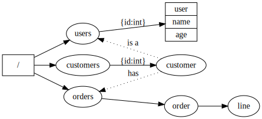

<!-- # Roll Your Own Compositional Graph Query Language -->

# GraphQL Notes

I'm excited by GraphQL and technologies like GraphQL because they empower front-end developers to request exactly what they need from the server.

It's like SQL, but with a few differences (This isn't an exhaustive list):

1. The data source is not restricted to a relational data source.
2. Results can be objects with nested results in addition to queries.
3. Queries resemble the structures returned.

## Don't Build APIs You're Not Going to Need

The biggest benefit of GraphQL is it allows you to build API's that empower the consumers to get what they need.  Having written APIs for other programmers,  and consumed APIs written by other programmers, there's a lot of ways

